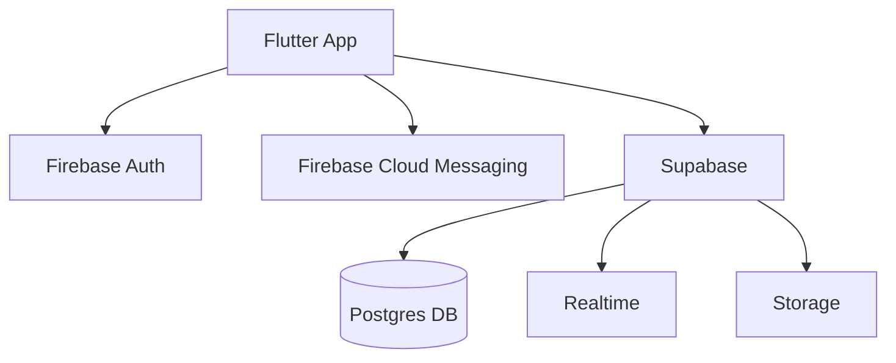

# Visão Geral e Estrutura do Projeto

Este documento oferece uma visão clara e prática da arquitetura, banco de dados, integrações (Firebase x Supabase), lógica principal e comandos úteis, para acelerar o onboarding de novos desenvolvedores.

## 1) Arquitetura Geral do Sistema

- App Flutter (multi-plataforma) com telas e widgets gerados pelo FlutterFlow e código customizado em `lib/custom_code/`.
- Backend de Negócio: Supabase (Postgres + Realtime + Storage). Toda lógica de dados, consultas, tempo real e persistência acontece aqui.
- Autenticação e Push: Firebase (Auth + FCM). O UID do Firebase é a identidade primária externa; notificações push usam FCM.
- Integração em Tempo Real: Supabase Realtime para eventos de viagens, atualizações de localização e notificações in-app.

Diagrama (alto nível):



## 2) Estrutura de Pastas (essencial)

- `lib/` código-fonte principal
  - `auth_option/` fluxo de autenticação e cadastro
  - `main_motorista_option/` telas e lógica do motorista (ex.: dashboard)
  - `mai_passageiro_option/` telas e lógica do passageiro
  - `backend/` integrações (Firebase, Storage, Supabase, Realtime)
  - `flutter_flow/` utilitários e componentes gerados
  - `custom_code/` ações e widgets customizados
- `docs/` documentação de arquitetura e guias
- `misc/` utilitários e schema do Supabase (`supabase_schema_complete.json`)

## 3) Banco de Dados e Relações (Supabase)

Tabelas-chave: `app_users`, `drivers`, `passengers`, `driver_wallets`, `passenger_wallets`, `trips`, `trip_requests`, `trip_stops`, `ratings`, `driver_status`, `location_updates`, `notifications`.

Relações principais:
- `Firebase Auth (UID)` → `app_users.currentUser_UID_Firebase` (vínculo identidade)
- `app_users.id` → `drivers.user_id` (1:1 papel motorista)
- `app_users.id` → `passengers.user_id` (1:1 papel passageiro)
- `drivers.id` → `driver_wallets.driver_id` (1:1 carteira motorista)
- `passengers.id` → `passenger_wallets.passenger_id` (1:1 carteira passageiro)

Diagrama (relacionamentos):

```mermaid
graph TD
  subgraph Firebase
    FA[Firebase Auth (UID)]
  end
  subgraph Supabase
    AU[app_users\n- id (uuid) PK\n- currentUser_UID_Firebase (text)]
    DR[drivers\n- id (uuid) PK\n- user_id (uuid) FK->app_users.id]
    PA[passengers\n- id (uuid) PK\n- user_id (uuid) FK->app_users.id]
    DW[driver_wallets\n- id (uuid) PK\n- driver_id (uuid) FK->drivers.id]
    PW[passenger_wallets\n- id (uuid) PK\n- passenger_id (uuid) FK->passengers.id]
  end
  FA -- armazena UID em --> AU
  AU -- 1:1 --> DR
  AU -- 1:1 --> PA
  DR -- 1:1 --> DW
  PA -- 1:1 --> PW
```

Observações:
- Sem RLS no MVP: validações e segurança devem ser tratadas pela aplicação/servidor responsável.
- Indíces e views específicas podem existir para consultas de alta performance (ex.: motoristas disponíveis).

## 4) Firebase x Supabase (Diferenças e Integração)

- Firebase
  - Auth: criação/login de usuários. UID armazenado em `app_users.currentUser_UID_Firebase`.
  - FCM: push notifications (delivery). Tokens gerenciados e vinculados a usuários/dispositivos.
- Supabase
  - Banco de dados principal (Postgres) + Realtime + Storage.
  - Lógica de viagens, matching, atualizações e histórico.
- Integração
  - App autentica no Firebase; após login, sincroniza/consulta o perfil em `app_users` (via UID).
  - Eventos in-app em tempo real via Supabase; notificações urgentes via FCM.

## 5) Lógica Principal do Projeto

Fluxo Passageiro (resumo):
1. Solicitar viagem (origem/destino/paradas) → cria `trip_requests` e aciona matching inteligente no Supabase.
2. Recebe oferta/atribuição de motorista em tempo real; acompanha status e localização.
3. Conclusão → pagamento/registros → avaliação em `ratings`.

Fluxo Motorista (resumo):
1. Define disponibilidade (`driver_status`), áreas de atuação e exclusões.
2. Recebe ofertas de corridas (in-app + push), aceita/recusa, inicia deslocamento.
3. Atualiza localização (`location_updates`), encerra viagem e registra ganhos (`wallets`).

Componentes e arquivos relevantes (exemplos):
- `lib/main_motorista_option/main_motorista/` dashboard do motorista.
- `lib/mai_passageiro_option/` fluxo do passageiro.
- `lib/custom_code/actions/` ações personalizadas (matching, notificações, etc.).
- `lib/backend/supabase/` acesso a dados e realtime.

## 6) Comandos Úteis

- Desenvolvimento: `flutter run` | Web: `flutter run -d chrome`
- Qualidade: `flutter analyze` e `dart format .`
- Testes: `flutter test`
- Build Android: `flutter build apk`
- Build iOS: `flutter build ios`

## 7) Onboarding Rápido

1. Pré-requisitos: Flutter SDK, Android Studio/Xcode, acesso a Firebase e Supabase do projeto.
2. Variáveis/Configs: confira `.env`, `android/app/google-services.json` e `ios/Runner/GoogleService-Info.plist`.
3. Dependências: `flutter pub get`.
4. Rodar: `flutter run` (ou selecione um dispositivo/emulador).

## 8) Boas Práticas

- SRP e separação de camadas: mantenha responsabilidades isoladas por módulo.
- Evite lógica pesada nos Widgets; prefira serviços e repositórios.
- Logs de segurança e trilhas de auditoria para eventos críticos.
- Sem chaves/segredos no código-fonte. Use armazenamento seguro.

---

Este guia cobre o essencial da arquitetura e operação do projeto. Consulte os demais arquivos em `docs/` para aprofundamento em domínios específicos e decisões de design.