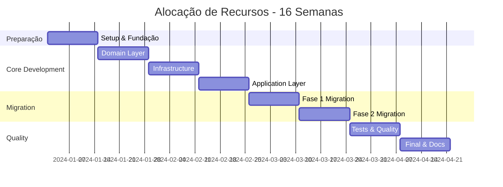

# Plano de Refatoração Realista - Flutter + Supabase para Clean Architecture

## 📋 Resumo Executivo

### 🎯 Objetivo
Migrar gradualmente a arquitetura atual (Active Record) para Clean Architecture, mantendo 100% da funcionalidade existente e sem interrupções no desenvolvimento.

### 📊 Métricas de Sucesso
- **Cobertura de Testes**: 0% → 80%
- **Tempo de Build**: Manter < 2min
- **Bugs em Produção**: Reduzir 60%
- **Tempo de Desenvolvimento**: Reduzir 40% (após migração)
- **Acoplamento**: Alto → Baixo (medido por dependências)

### ⚠️ Riscos Identificados
1. **Alto**: Quebra de funcionalidades existentes
2. **Médio**: Aumento temporário da complexidade
3. **Médio**: Resistência da equipe à mudança
4. **Baixo**: Performance degradada

---

## 🔍 Análise de Complexidade Técnica

### 🏗️ Estado Atual Detalhado

#### Dependências Críticas
```yaml
# Análise de Impacto
Custom Actions: 47 arquivos
├── Dependem diretamente de SupabaseTable: 35 arquivos
├── Lógica de negócio complexa: 12 arquivos
├── Queries com múltiplas tabelas: 8 arquivos
└── Validações inline: 23 arquivos

Tabelas Supabase: 47 tabelas
├── Relacionamentos 1:N: 15 relacionamentos
├── Relacionamentos N:N: 3 relacionamentos
├── Campos calculados: 8 tabelas
└── Triggers ativos: 5 tabelas
```

#### Pontos de Integração
```dart
// Integrações Externas Identificadas
1. Firebase Auth (user_id como string)
2. Google Maps (LatLng, geocoding)
3. FCM (push notifications)
4. Mapbox (search API)
5. Payment Gateway (futuro)
6. Real-time subscriptions (Supabase)
```

### 🎯 Escopo de Refatoração

#### Módulos Prioritários (Ordem de Impacto)
1. **🔥 Crítico - Sistema de Viagens**
   - `solicitar_viagem_inteligente.dart`
   - `aceitar_viagem_supabase.dart`
   - `processar_avaliacao.dart`
   - **Impacto**: 80% das operações do app

2. **🟡 Alto - Gestão de Usuários**
   - `fcm_service_completo.dart`
   - Auth flows
   - Profile management
   - **Impacto**: 60% das operações

3. **🟢 Médio - Features Auxiliares**
   - Notifications
   - Settings
   - Document management
   - **Impacto**: 30% das operações

---

## 📅 Cronograma Detalhado (16 Semanas)

### 🏃‍♂️ Sprint 1-2: Preparação e Fundação (2 semanas)

#### Objetivos
- Estabelecer base sólida para refatoração
- Configurar ferramentas de qualidade
- Criar estrutura de testes

#### Entregáveis
```dart
// Semana 1
✅ Setup de ferramentas de análise
├── dart_code_metrics configurado
├── test_coverage configurado
├── CI/CD pipeline atualizado
└── Baseline de métricas estabelecido

✅ Estrutura de diretórios
├── lib/domain/
│   ├── entities/
│   ├── repositories/
│   └── value_objects/
├── lib/application/
│   ├── use_cases/
│   └── services/
├── lib/infrastructure/
│   ├── repositories/
│   └── adapters/
└── test/
    ├── unit/
    ├── integration/
    └── fixtures/
```

```dart
// Semana 2
✅ Entidades de domínio base
// lib/domain/entities/user.dart
class User {
  final UserId id;
  final Email email;
  final UserType type;
  final DateTime createdAt;
  
  const User({
    required this.id,
    required this.email,
    required this.type,
    required this.createdAt,
  });
  
  bool canPerformAction(Action action) {
    return type.allowsAction(action);
  }
}

// lib/domain/value_objects/user_id.dart
class UserId {
  final String value;
  
  const UserId(this.value);
  
  factory UserId.fromFirebase(String firebaseUid) {
    if (firebaseUid.isEmpty) {
      throw InvalidUserIdException('Firebase UID cannot be empty');
    }
    return UserId(firebaseUid);
  }
}
```

#### Critérios de Aceitação
- [ ] Estrutura de diretórios criada
- [ ] Ferramentas de qualidade funcionando
- [ ] Primeiras entidades com testes unitários
- [ ] Documentação de padrões estabelecida

---

### 🏗️ Sprint 3-4: Domain Layer Completo (2 semanas)

#### Objetivos
- Implementar todas as entidades de domínio
- Definir contratos dos repositories
- Criar value objects essenciais

#### Entregáveis
```dart
// Semana 3: Entidades Principais
✅ Driver Entity
class Driver {
  final DriverId id;
  final UserId userId;
  final Vehicle vehicle;
  final DriverStatus status;
  final ServiceConfiguration services;
  final Location? currentLocation;
  
  bool canAcceptTrip(TripRequest request) {
    return status.isOnline && 
           vehicle.supportsCategory(request.vehicleCategory) &&
           services.meetsRequirements(request.requirements);
  }
  
  Money calculateFee(TripRequest request) {
    var baseFee = Money.zero();
    if (request.needsPet && services.acceptsPet) {
      baseFee = baseFee.add(services.petFee);
    }
    // ... outras taxas
    return baseFee;
  }
}

✅ Trip Entity
class Trip {
  final TripId id;
  final PassengerId passengerId;
  final DriverId? driverId;
  final TripStatus status;
  final Route route;
  final Money fare;
  final List<TripEvent> events;
  
  Result<Trip> assignDriver(Driver driver) {
    if (!driver.canAcceptTrip(this.toRequest())) {
      return Result.failure('Driver cannot accept this trip');
    }
    
    return Result.success(
      copyWith(
        driverId: driver.id,
        status: TripStatus.driverAssigned(),
        events: [...events, TripEvent.driverAssigned(driver.id)],
      ),
    );
  }
}
```

```dart
// Semana 4: Value Objects e Repositories
✅ Value Objects Críticos
class Location {
  final double latitude;
  final double longitude;
  final DateTime timestamp;
  
  Distance distanceTo(Location other) {
    // Implementação usando fórmula de Haversine
  }
  
  bool isWithinRadius(Location center, Distance radius) {
    return distanceTo(center).isLessThan(radius);
  }
}

class Money {
  final int centavos; // Evita problemas de ponto flutuante
  
  Money.fromReais(double reais) : centavos = (reais * 100).round();
  
  double get reais => centavos / 100.0;
  
  Money add(Money other) => Money._(centavos + other.centavos);
}

✅ Repository Contracts
abstract class DriverRepository {
  Future<Driver?> findByUserId(UserId userId);
  Future<List<Driver>> findAvailableInRadius(
    Location center, 
    Distance radius,
    {VehicleCategory? category}
  );
  Future<void> save(Driver driver);
  Future<void> updateLocation(DriverId id, Location location);
}
```

#### Critérios de Aceitação
- [ ] 15+ entidades implementadas com testes
- [ ] Value objects com validações robustas
- [ ] Contratos de repositories definidos
- [ ] Cobertura de testes > 90% no domain layer

---

### 🔧 Sprint 5-6: Infrastructure Layer (2 semanas)

#### Objetivos
- Implementar adapters para Supabase
- Manter compatibilidade com código existente
- Criar mappers robustos

#### Entregáveis
```dart
// Semana 5: Repository Implementations
✅ Supabase Driver Repository
class SupabaseDriverRepository implements DriverRepository {
  final DriversTable _driversTable;
  final AppUsersTable _usersTable;
  final DriverMapper _mapper;
  
  @override
  Future<Driver?> findByUserId(UserId userId) async {
    try {
      final rows = await _driversTable.queryRows(
        queryFn: (q) => q.eq('user_id', userId.value),
      );
      
      if (rows.isEmpty) return null;
      
      return _mapper.toDomain(rows.first);
    } on PostgrestException catch (e) {
      throw RepositoryException('Failed to find driver: ${e.message}');
    }
  }
  
  @override
  Future<List<Driver>> findAvailableInRadius(
    Location center, 
    Distance radius,
    {VehicleCategory? category}
  ) async {
    // Implementação com query geográfica otimizada
    final query = _driversTable.select()
        .eq('is_online', true)
        .gte('last_location_update', 
             DateTime.now().subtract(Duration(minutes: 5)))
        .rpc('drivers_within_radius', {
          'center_lat': center.latitude,
          'center_lng': center.longitude,
          'radius_km': radius.kilometers,
        });
    
    if (category != null) {
      query.eq('vehicle_category', category.value);
    }
    
    final rows = await query.execute();
    return rows.map(_mapper.toDomain).toList();
  }
}
```

```dart
// Semana 6: Mappers e Error Handling
✅ Domain Mappers
class DriverMapper {
  Driver toDomain(DriversRow row) {
    return Driver(
      id: DriverId(row.id),
      userId: UserId(row.userId),
      vehicle: Vehicle(
        brand: row.vehicleBrand ?? '',
        model: row.vehicleModel ?? '',
        category: VehicleCategory.fromString(row.vehicleCategory),
        plate: row.vehiclePlate ?? '',
      ),
      status: DriverStatus(
        isOnline: row.isOnline ?? false,
        isAvailable: row.isAvailable ?? false,
        lastSeen: row.lastLocationUpdate,
      ),
      services: ServiceConfiguration(
        acceptsPet: row.acceptsPet ?? false,
        acceptsGrocery: row.acceptsGrocery ?? false,
        acceptsCondo: row.acceptsCondo ?? false,
        petFee: Money.fromReais(row.petFee ?? 0),
        groceryFee: Money.fromReais(row.groceryFee ?? 0),
        condoFee: Money.fromReais(row.condoFee ?? 0),
      ),
      currentLocation: row.currentLatitude != null && row.currentLongitude != null
          ? Location(
              latitude: row.currentLatitude!,
              longitude: row.currentLongitude!,
              timestamp: row.lastLocationUpdate ?? DateTime.now(),
            )
          : null,
    );
  }
  
  Map<String, dynamic> toSupabase(Driver driver) {
    return {
      'id': driver.id.value,
      'user_id': driver.userId.value,
      'vehicle_brand': driver.vehicle.brand,
      'vehicle_model': driver.vehicle.model,
      'vehicle_category': driver.vehicle.category.value,
      'vehicle_plate': driver.vehicle.plate,
      'is_online': driver.status.isOnline,
      'is_available': driver.status.isAvailable,
      'accepts_pet': driver.services.acceptsPet,
      'accepts_grocery': driver.services.acceptsGrocery,
      'accepts_condo': driver.services.acceptsCondo,
      'pet_fee': driver.services.petFee.reais,
      'grocery_fee': driver.services.groceryFee.reais,
      'condo_fee': driver.services.condoFee.reais,
      'current_latitude': driver.currentLocation?.latitude,
      'current_longitude': driver.currentLocation?.longitude,
      'last_location_update': driver.currentLocation?.timestamp.toIso8601String(),
    };
  }
}

✅ Error Handling
class RepositoryException implements Exception {
  final String message;
  final Exception? cause;
  
  const RepositoryException(this.message, [this.cause]);
}

class DomainException implements Exception {
  final String message;
  final String code;
  
  const DomainException(this.message, this.code);
}
```

#### Critérios de Aceitação
- [ ] Todos os repositories implementados
- [ ] Mappers com tratamento de edge cases
- [ ] Error handling robusto
- [ ] Testes de integração passando

---

### 🎯 Sprint 7-8: Application Layer (2 semanas)

#### Objetivos
- Implementar use cases principais
- Criar services de aplicação
- Estabelecer orquestração de operações

#### Entregáveis
```dart
// Semana 7: Use Cases Críticos
✅ Accept Trip Use Case
class AcceptTripUseCase {
  final DriverRepository _driverRepo;
  final TripRepository _tripRepo;
  final NotificationService _notificationService;
  final LocationService _locationService;
  
  AcceptTripUseCase({
    required DriverRepository driverRepo,
    required TripRepository tripRepo,
    required NotificationService notificationService,
    required LocationService locationService,
  }) : _driverRepo = driverRepo,
       _tripRepo = tripRepo,
       _notificationService = notificationService,
       _locationService = locationService;
  
  Future<Result<Trip>> execute(AcceptTripRequest request) async {
    try {
      // 1. Validar motorista
      final driver = await _driverRepo.findByUserId(request.driverId);
      if (driver == null) {
        return Result.failure(
          DomainException('Driver not found', 'DRIVER_NOT_FOUND')
        );
      }
      
      if (!driver.status.canAcceptTrips) {
        return Result.failure(
          DomainException('Driver cannot accept trips', 'DRIVER_UNAVAILABLE')
        );
      }
      
      // 2. Buscar solicitação de viagem
      final tripRequest = await _tripRepo.findRequest(request.tripRequestId);
      if (tripRequest == null) {
        return Result.failure(
          DomainException('Trip request not found', 'REQUEST_NOT_FOUND')
        );
      }
      
      if (!tripRequest.isAvailable()) {
        return Result.failure(
          DomainException('Trip request no longer available', 'REQUEST_UNAVAILABLE')
        );
      }
      
      // 3. Validar compatibilidade
      if (!driver.canAcceptTrip(tripRequest)) {
        return Result.failure(
          DomainException('Driver cannot accept this trip type', 'INCOMPATIBLE_TRIP')
        );
      }
      
      // 4. Criar viagem
      final trip = Trip.fromRequest(
        request: tripRequest,
        driver: driver,
        estimatedFare: _calculateFare(tripRequest, driver),
      );
      
      // 5. Salvar no repositório
      await _tripRepo.save(trip);
      
      // 6. Atualizar status do motorista
      final updatedDriver = driver.acceptTrip(trip.id);
      await _driverRepo.save(updatedDriver);
      
      // 7. Notificar passageiro
      await _notificationService.notifyTripAccepted(
        passengerId: trip.passengerId,
        trip: trip,
        driver: driver,
      );
      
      // 8. Iniciar tracking de localização
      await _locationService.startTripTracking(trip.id, driver.id);
      
      return Result.success(trip);
      
    } on DomainException catch (e) {
      return Result.failure(e);
    } on RepositoryException catch (e) {
      return Result.failure(
        DomainException('Failed to accept trip: ${e.message}', 'REPOSITORY_ERROR')
      );
    } catch (e) {
      return Result.failure(
        DomainException('Unexpected error: $e', 'UNKNOWN_ERROR')
      );
    }
  }
  
  Money _calculateFare(TripRequest request, Driver driver) {
    var fare = request.baseFare;
    
    // Adicionar taxas específicas do motorista
    if (request.needsPet && driver.services.acceptsPet) {
      fare = fare.add(driver.services.petFee);
    }
    
    if (request.needsGrocery && driver.services.acceptsGrocery) {
      fare = fare.add(driver.services.groceryFee);
    }
    
    if (request.needsCondo && driver.services.acceptsCondo) {
      fare = fare.add(driver.services.condoFee);
    }
    
    // Adicionar taxa por paradas extras
    final extraStops = request.stops.length;
    if (extraStops > 0) {
      fare = fare.add(driver.services.stopFee.multiply(extraStops));
    }
    
    return fare;
  }
}
```

```dart
// Semana 8: Services e Orquestração
✅ Intelligent Trip Request Service
class IntelligentTripRequestService {
  final TripRepository _tripRepo;
  final DriverRepository _driverRepo;
  final NotificationService _notificationService;
  final DriverMatchingAlgorithm _matchingAlgorithm;
  
  Future<Result<TripRequest>> requestTrip(
    CreateTripRequest request
  ) async {
    try {
      // 1. Validar passageiro
      final passenger = await _passengerRepo.findByUserId(request.passengerId);
      if (passenger == null || !passenger.canRequestTrip()) {
        return Result.failure(
          DomainException('Passenger cannot request trip', 'PASSENGER_INVALID')
        );
      }
      
      // 2. Criar solicitação
      final tripRequest = TripRequest.create(
        passengerId: request.passengerId,
        origin: request.origin,
        destination: request.destination,
        stops: request.stops,
        requirements: request.requirements,
        estimatedFare: _calculateEstimatedFare(request),
      );
      
      // 3. Salvar solicitação
      await _tripRepo.saveRequest(tripRequest);
      
      // 4. Buscar motoristas compatíveis
      final availableDrivers = await _findCompatibleDrivers(tripRequest);
      
      if (availableDrivers.isEmpty) {
        return Result.failure(
          DomainException('No drivers available', 'NO_DRIVERS_AVAILABLE')
        );
      }
      
      // 5. Aplicar algoritmo de matching inteligente
      final rankedDrivers = await _matchingAlgorithm.rankDrivers(
        drivers: availableDrivers,
        request: tripRequest,
      );
      
      // 6. Notificar motoristas em ordem de prioridade
      await _notifyDriversSequentially(tripRequest, rankedDrivers);
      
      return Result.success(tripRequest);
      
    } catch (e) {
      return Result.failure(
        DomainException('Failed to request trip: $e', 'REQUEST_FAILED')
      );
    }
  }
  
  Future<List<Driver>> _findCompatibleDrivers(TripRequest request) async {
    const searchRadius = Distance.kilometers(15);
    
    final driversInRadius = await _driverRepo.findAvailableInRadius(
      request.origin,
      searchRadius,
      category: request.vehicleCategory,
    );
    
    return driversInRadius
        .where((driver) => driver.canAcceptTrip(request))
        .toList();
  }
}
```

#### Critérios de Aceitação
- [ ] Use cases principais implementados
- [ ] Services de aplicação funcionais
- [ ] Orquestração de operações complexas
- [ ] Testes unitários > 85%

---

### 🔄 Sprint 9-10: Migração Gradual - Fase 1 (2 semanas)

#### Objetivos
- Migrar custom actions críticos
- Manter compatibilidade total
- Implementar adaptadores

#### Entregáveis
```dart
// Semana 9: Adapter Pattern para Custom Actions
✅ Legacy Action Adapter
class AcceptTripActionAdapter {
  final AcceptTripUseCase _useCase;
  
  AcceptTripActionAdapter(this._useCase);
  
  // Mantém a assinatura original para compatibilidade
  Future<Map<String, dynamic>> execute(Map<String, dynamic> params) async {
    try {
      final request = AcceptTripRequest(
        driverId: UserId(params['driver_id'] as String),
        tripRequestId: TripRequestId(params['trip_request_id'] as String),
      );
      
      final result = await _useCase.execute(request);
      
      return result.fold(
        onSuccess: (trip) => {
          'sucesso': true,
          'trip_id': trip.id.value,
          'passenger_id': trip.passengerId.value,
          'estimated_fare': trip.estimatedFare.reais,
        },
        onFailure: (error) => {
          'sucesso': false,
          'erro': error.message,
          'codigo': error.code,
        },
      );
    } catch (e) {
      return {
        'sucesso': false,
        'erro': 'Erro inesperado: $e',
      };
    }
  }
}

// Atualização do custom action existente
// lib/custom_code/actions/aceitar_viagem_supabase.dart
Future<Map<String, dynamic>> aceitarViagemSupabase(
  String tripRequestId,
  String driverId,
) async {
  // Usar o adapter para manter compatibilidade
  final adapter = GetIt.instance<AcceptTripActionAdapter>();
  
  return await adapter.execute({
    'trip_request_id': tripRequestId,
    'driver_id': driverId,
  });
}
```

```dart
// Semana 10: Dependency Injection Setup
✅ Service Locator Configuration
// lib/infrastructure/di/service_locator.dart
class ServiceLocator {
  static final GetIt _getIt = GetIt.instance;
  
  static Future<void> setup() async {
    // Repositories
    _getIt.registerLazySingleton<DriverRepository>(
      () => SupabaseDriverRepository(
        driversTable: DriversTable(),
        mapper: DriverMapper(),
      ),
    );
    
    _getIt.registerLazySingleton<TripRepository>(
      () => SupabaseTripRepository(
        tripsTable: TripsTable(),
        tripRequestsTable: TripRequestsTable(),
        mapper: TripMapper(),
      ),
    );
    
    // Services
    _getIt.registerLazySingleton<NotificationService>(
      () => SupabaseNotificationService(
        notificationsTable: NotificationsTable(),
        fcmService: FCMService(),
      ),
    );
    
    // Use Cases
    _getIt.registerFactory<AcceptTripUseCase>(
      () => AcceptTripUseCase(
        driverRepo: _getIt<DriverRepository>(),
        tripRepo: _getIt<TripRepository>(),
        notificationService: _getIt<NotificationService>(),
        locationService: _getIt<LocationService>(),
      ),
    );
    
    // Adapters
    _getIt.registerFactory<AcceptTripActionAdapter>(
      () => AcceptTripActionAdapter(_getIt<AcceptTripUseCase>()),
    );
  }
}

// Inicialização no main.dart
void main() async {
  WidgetsFlutterBinding.ensureInitialized();
  
  await ServiceLocator.setup();
  
  runApp(MyApp());
}
```

#### Critérios de Aceitação
- [ ] 5+ custom actions migrados
- [ ] Compatibilidade 100% mantida
- [ ] DI configurado e funcionando
- [ ] Testes de regressão passando

---

### 🚀 Sprint 11-12: Migração Gradual - Fase 2 (2 semanas)

#### Objetivos
- Migrar sistema de notificações
- Implementar real-time features
- Otimizar performance

#### Entregáveis
```dart
// Semana 11: Real-time Notification System
✅ Domain Events
abstract class DomainEvent {
  final DateTime occurredAt;
  final String eventId;
  
  DomainEvent() 
    : occurredAt = DateTime.now(),
      eventId = Uuid().v4();
}

class TripAcceptedEvent extends DomainEvent {
  final TripId tripId;
  final DriverId driverId;
  final PassengerId passengerId;
  
  TripAcceptedEvent({
    required this.tripId,
    required this.driverId,
    required this.passengerId,
  });
}

✅ Event Bus Implementation
class EventBus {
  final Map<Type, List<EventHandler>> _handlers = {};
  
  void subscribe<T extends DomainEvent>(EventHandler<T> handler) {
    _handlers.putIfAbsent(T, () => []).add(handler);
  }
  
  Future<void> publish(DomainEvent event) async {
    final handlers = _handlers[event.runtimeType] ?? [];
    
    for (final handler in handlers) {
      try {
        await handler.handle(event);
      } catch (e) {
        // Log error but don't stop other handlers
        print('Error handling event ${event.runtimeType}: $e');
      }
    }
  }
}

✅ Notification Event Handlers
class TripAcceptedNotificationHandler implements EventHandler<TripAcceptedEvent> {
  final NotificationService _notificationService;
  final PassengerRepository _passengerRepo;
  
  @override
  Future<void> handle(TripAcceptedEvent event) async {
    final passenger = await _passengerRepo.findById(event.passengerId);
    if (passenger == null) return;
    
    await _notificationService.sendPushNotification(
      userId: passenger.userId,
      title: 'Motorista a caminho!',
      body: 'Seu motorista aceitou a viagem e está a caminho.',
      data: {
        'trip_id': event.tripId.value,
        'type': 'trip_accepted',
      },
    );
  }
}
```

```dart
// Semana 12: Performance Optimizations
✅ Repository Caching
class CachedDriverRepository implements DriverRepository {
  final DriverRepository _repository;
  final Cache<String, Driver> _cache;
  
  CachedDriverRepository(this._repository, this._cache);
  
  @override
  Future<Driver?> findByUserId(UserId userId) async {
    final cached = _cache.get(userId.value);
    if (cached != null) return cached;
    
    final driver = await _repository.findByUserId(userId);
    if (driver != null) {
      _cache.put(userId.value, driver, ttl: Duration(minutes: 5));
    }
    
    return driver;
  }
  
  @override
  Future<void> save(Driver driver) async {
    await _repository.save(driver);
    _cache.put(driver.userId.value, driver, ttl: Duration(minutes: 5));
  }
}

✅ Query Optimization
class OptimizedSupabaseTripRepository extends SupabaseTripRepository {
  @override
  Future<List<Driver>> findAvailableInRadius(
    Location center, 
    Distance radius,
    {VehicleCategory? category}
  ) async {
    // Usar índice geográfico otimizado
    final query = '''
      SELECT d.*, u.email, u.phone
      FROM drivers d
      JOIN app_users u ON d.user_id = u.id
      WHERE d.is_online = true
        AND d.is_available = true
        AND d.last_location_update > NOW() - INTERVAL '5 minutes'
        AND ST_DWithin(
          ST_Point(d.current_longitude, d.current_latitude)::geography,
          ST_Point(?, ?)::geography,
          ?
        )
    ''';
    
    final params = [
      center.longitude,
      center.latitude,
      radius.meters,
    ];
    
    if (category != null) {
      query += ' AND d.vehicle_category = ?';
      params.add(category.value);
    }
    
    query += ' ORDER BY ST_Distance(
      ST_Point(d.current_longitude, d.current_latitude)::geography,
      ST_Point(?, ?)::geography
    ) LIMIT 20';
    
    params.addAll([center.longitude, center.latitude]);
    
    final result = await supabase.rpc('find_available_drivers', {
      'query': query,
      'params': params,
    });
    
    return result.map((row) => _mapper.toDomain(row)).toList();
  }
}
```

#### Critérios de Aceitação
- [ ] Sistema de eventos implementado
- [ ] Notificações real-time funcionando
- [ ] Performance otimizada (queries < 500ms)
- [ ] Cache implementado e testado

---

### 🎯 Sprint 13-14: Testes e Qualidade (2 semanas)

#### Objetivos
- Implementar testes abrangentes
- Configurar CI/CD
- Estabelecer métricas de qualidade

#### Entregáveis
```dart
// Semana 13: Testes Unitários e de Integração
✅ Test Fixtures e Builders
// test/fixtures/driver_fixture.dart
class DriverFixture {
  static Driver online({String? id, Location? location}) {
    return Driver(
      id: DriverId(id ?? 'driver_123'),
      userId: UserId('user_123'),
      vehicle: VehicleFixture.sedan(),
      status: DriverStatus(
        isOnline: true,
        isAvailable: true,
        lastSeen: DateTime.now(),
      ),
      services: ServiceConfigurationFixture.standard(),
      currentLocation: location ?? LocationFixture.sampleLocation(),
    );
  }
  
  static Driver offline() {
    return online().copyWith(
      status: DriverStatus(
        isOnline: false,
        isAvailable: false,
        lastSeen: DateTime.now().subtract(Duration(hours: 1)),
      ),
    );
  }
}

✅ Use Case Tests
// test/unit/application/use_cases/accept_trip_use_case_test.dart
class AcceptTripUseCaseTest {
  late MockDriverRepository mockDriverRepo;
  late MockTripRepository mockTripRepo;
  late MockNotificationService mockNotificationService;
  late AcceptTripUseCase useCase;
  
  setUp(() {
    mockDriverRepo = MockDriverRepository();
    mockTripRepo = MockTripRepository();
    mockNotificationService = MockNotificationService();
    
    useCase = AcceptTripUseCase(
      driverRepo: mockDriverRepo,
      tripRepo: mockTripRepo,
      notificationService: mockNotificationService,
      locationService: MockLocationService(),
    );
  });
  
  group('AcceptTripUseCase', () {
    testWidgets('should accept trip when driver is available', () async {
      // Arrange
      final driver = DriverFixture.online();
      final tripRequest = TripRequestFixture.standard();
      
      when(() => mockDriverRepo.findByUserId(any()))
          .thenAnswer((_) async => driver);
      when(() => mockTripRepo.findRequest(any()))
          .thenAnswer((_) async => tripRequest);
      when(() => mockTripRepo.save(any()))
          .thenAnswer((_) async {});
      
      // Act
      final result = await useCase.execute(
        AcceptTripRequest(
          driverId: driver.userId,
          tripRequestId: tripRequest.id,
        ),
      );
      
      // Assert
      expect(result.isSuccess, true);
      verify(() => mockTripRepo.save(any())).called(1);
      verify(() => mockNotificationService.notifyTripAccepted(
        passengerId: tripRequest.passengerId,
        trip: any(named: 'trip'),
        driver: driver,
      )).called(1);
    });
    
    testWidgets('should fail when driver is offline', () async {
      // Arrange
      final driver = DriverFixture.offline();
      
      when(() => mockDriverRepo.findByUserId(any()))
          .thenAnswer((_) async => driver);
      
      // Act
      final result = await useCase.execute(
        AcceptTripRequest(
          driverId: driver.userId,
          tripRequestId: TripRequestId('trip_123'),
        ),
      );
      
      // Assert
      expect(result.isFailure, true);
      expect(result.error.code, 'DRIVER_UNAVAILABLE');
      verifyNever(() => mockTripRepo.save(any()));
    });
  });
}
```

```dart
// Semana 14: Testes de Performance e E2E
✅ Performance Tests
// test/performance/driver_matching_performance_test.dart
void main() {
  group('Driver Matching Performance', () {
    late DriverRepository driverRepo;
    late IntelligentTripRequestService service;
    
    setUpAll(() async {
      // Setup com dados de teste em massa
      driverRepo = await setupTestDatabase();
      await seedDrivers(1000); // 1000 motoristas para teste
      
      service = IntelligentTripRequestService(
        driverRepo: driverRepo,
        // ... outros deps
      );
    });
    
    test('should find drivers within 2 seconds for 100 concurrent requests', () async {
      final stopwatch = Stopwatch()..start();
      
      final futures = List.generate(100, (index) {
        return service.findCompatibleDrivers(
          TripRequestFixture.randomLocation(),
        );
      });
      
      final results = await Future.wait(futures);
      stopwatch.stop();
      
      expect(stopwatch.elapsedMilliseconds, lessThan(2000));
      expect(results.every((drivers) => drivers.isNotEmpty), true);
    });
  });
}

✅ Integration Tests
// test/integration/trip_flow_integration_test.dart
void main() {
  group('Complete Trip Flow Integration', () {
    testWidgets('should complete full trip lifecycle', (tester) async {
      // 1. Setup
      await setupTestApp(tester);
      
      // 2. Passenger requests trip
      await tester.tap(find.byKey(Key('request_trip_button')));
      await tester.pumpAndSettle();
      
      // 3. Driver accepts trip
      await simulateDriverAcceptance();
      await tester.pumpAndSettle();
      
      // 4. Verify UI updates
      expect(find.text('Motorista a caminho'), findsOneWidget);
      
      // 5. Complete trip
      await simulateTripCompletion();
      await tester.pumpAndSettle();
      
      // 6. Verify final state
      expect(find.text('Viagem concluída'), findsOneWidget);
    });
  });
}
```

#### Critérios de Aceitação
- [ ] Cobertura de testes > 80%
- [ ] Testes de performance passando
- [ ] CI/CD configurado
- [ ] Métricas de qualidade estabelecidas

---

### 🏁 Sprint 15-16: Finalização e Documentação (2 semanas)

#### Objetivos
- Migrar custom actions restantes
- Documentar arquitetura final
- Treinar equipe
- Estabelecer guidelines

#### Entregáveis
```dart
// Semana 15: Migração Final
✅ Remaining Custom Actions Migration
// Migrar todos os custom actions restantes usando o padrão estabelecido

✅ Performance Monitoring
class PerformanceMonitor {
  static final Map<String, List<Duration>> _metrics = {};
  
  static Future<T> measure<T>(
    String operation,
    Future<T> Function() function,
  ) async {
    final stopwatch = Stopwatch()..start();
    
    try {
      final result = await function();
      return result;
    } finally {
      stopwatch.stop();
      _recordMetric(operation, stopwatch.elapsed);
    }
  }
  
  static void _recordMetric(String operation, Duration duration) {
    _metrics.putIfAbsent(operation, () => []).add(duration);
    
    // Log slow operations
    if (duration.inMilliseconds > 1000) {
      print('SLOW OPERATION: $operation took ${duration.inMilliseconds}ms');
    }
  }
  
  static Map<String, double> getAverages() {
    return _metrics.map((operation, durations) {
      final average = durations
          .map((d) => d.inMilliseconds)
          .reduce((a, b) => a + b) / durations.length;
      return MapEntry(operation, average);
    });
  }
}
```

```markdown
# Semana 16: Documentação e Guidelines

## Architecture Decision Records (ADRs)

### ADR-001: Clean Architecture Implementation
**Status**: Accepted
**Date**: 2024-01-XX

**Context**: 
O projeto Flutter + Supabase estava usando padrão Active Record com acoplamento alto.

**Decision**: 
Implementar Clean Architecture com Domain-Driven Design.

**Consequences**:
- ✅ Maior testabilidade
- ✅ Menor acoplamento
- ✅ Melhor manutenibilidade
- ❌ Maior complexidade inicial
- ❌ Mais código boilerplate

### ADR-002: Repository Pattern with Supabase
**Status**: Accepted
**Date**: 2024-01-XX

**Context**: 
Necessidade de abstrair acesso aos dados do Supabase.

**Decision**: 
Implementar Repository Pattern com mappers dedicados.

**Consequences**:
- ✅ Fácil troca de tecnologia
- ✅ Testes unitários rápidos
- ✅ Separação clara de responsabilidades

## Development Guidelines

### 1. Criando Nova Funcionalidade

```bash
# 1. Criar branch
git checkout -b feature/domain/new-feature

# 2. Implementar na ordem:
# - Domain entities
# - Repository contracts
# - Use cases
# - Infrastructure implementations
# - UI adapters

# 3. Testes obrigatórios
flutter test test/unit/domain/
flutter test test/unit/application/
flutter test test/integration/

# 4. Verificar qualidade
flutter analyze
dart format .
flutter test --coverage
```

### 2. Padrões de Código

```dart
// ✅ BOM: Use cases com Result pattern
Future<Result<Trip>> execute(AcceptTripRequest request) async {
  try {
    // lógica
    return Result.success(trip);
  } catch (e) {
    return Result.failure(DomainException('Error', 'CODE'));
  }
}

// ❌ RUIM: Exceptions não tratadas
Future<Trip> execute(AcceptTripRequest request) async {
  // pode lançar exception não tratada
  return trip;
}

// ✅ BOM: Value objects para validação
class Email {
  final String value;
  
  Email(this.value) {
    if (!_isValid(value)) {
      throw InvalidEmailException(value);
    }
  }
}

// ❌ RUIM: Strings primitivas
class User {
  final String email; // sem validação
}
```

### 3. Testing Strategy

```dart
// Pirâmide de Testes
// 70% Unit Tests (domain + application)
// 20% Integration Tests (infrastructure)
// 10% E2E Tests (UI flows)

// Mock repositories para testes rápidos
class MockDriverRepository extends Mock implements DriverRepository {}

// Test fixtures para dados consistentes
class DriverFixture {
  static Driver online() => Driver(/* ... */);
}

// Builders para cenários complexos
class TripRequestBuilder {
  TripRequest build() => TripRequest(/* ... */);
  TripRequestBuilder withPet() { /* ... */ return this; }
}
```
```

#### Critérios de Aceitação
- [ ] 100% dos custom actions migrados
- [ ] Documentação completa
- [ ] Guidelines estabelecidos
- [ ] Equipe treinada
- [ ] Métricas de sucesso atingidas

---

## 📊 Métricas e Monitoramento

### 🎯 KPIs de Sucesso

| Métrica | Antes | Meta | Como Medir |
|---------|-------|------|------------|
| **Cobertura de Testes** | 0% | 80% | `flutter test --coverage` |
| **Tempo de Build** | ~2min | <2min | CI/CD pipeline |
| **Bugs em Produção** | Baseline | -60% | Crash analytics |
| **Tempo de Desenvolvimento** | Baseline | -40% | Story points/sprint |
| **Acoplamento (Afferent Coupling)** | Alto | <5 | `dart_code_metrics` |
| **Complexidade Ciclomática** | >10 | <7 | `dart_code_metrics` |
| **Duplicação de Código** | >15% | <5% | `dart_code_metrics` |

### 📈 Monitoramento Contínuo

```yaml
# .github/workflows/quality_check.yml
name: Quality Check
on: [push, pull_request]

jobs:
  quality:
    runs-on: ubuntu-latest
    steps:
      - uses: actions/checkout@v3
      - uses: subosito/flutter-action@v2
      
      - name: Install dependencies
        run: flutter pub get
        
      - name: Analyze code
        run: flutter analyze --fatal-infos
        
      - name: Check formatting
        run: dart format --output=none --set-exit-if-changed .
        
      - name: Run tests
        run: flutter test --coverage
        
      - name: Check coverage
        run: |
          lcov --summary coverage/lcov.info
          # Fail if coverage < 80%
          
      - name: Code metrics
        run: |
          dart run dart_code_metrics:metrics analyze lib
          dart run dart_code_metrics:metrics check-unused-files lib
```

---

## ⚠️ Gestão de Riscos

### 🔴 Riscos Altos

#### 1. Quebra de Funcionalidades Existentes
**Probabilidade**: 30% | **Impacto**: Alto

**Mitigação**:
- Testes de regressão automatizados
- Feature flags para rollback rápido
- Migração gradual com adaptadores
- Code review obrigatório

**Plano de Contingência**:
```dart
// Feature flag para rollback
if (FeatureFlags.useCleanArchitecture) {
  return await newAcceptTripUseCase.execute(request);
} else {
  return await legacyAcceptTrip(request);
}
```

#### 2. Resistência da Equipe
**Probabilidade**: 40% | **Impacto**: Médio

**Mitigação**:
- Treinamento gradual (2h/semana)
- Pair programming nas primeiras implementações
- Documentação clara com exemplos
- Demonstração dos benefícios com métricas

### 🟡 Riscos Médios

#### 3. Aumento Temporário da Complexidade
**Probabilidade**: 60% | **Impacto**: Médio

**Mitigação**:
- Templates e generators para boilerplate
- Guidelines claros de implementação
- Code snippets no IDE
- Revisão arquitetural semanal

#### 4. Performance Degradada
**Probabilidade**: 20% | **Impacto**: Médio

**Mitigação**:
- Benchmarks antes/depois
- Profiling contínuo
- Cache estratégico
- Otimização de queries

---

## 💰 Estimativa de Recursos

### 👥 Equipe Necessária

| Papel | Dedicação | Responsabilidades |
|-------|-----------|-------------------|
| **Tech Lead** | 100% | Arquitetura, code review, mentoria |
| **Senior Developer** | 80% | Implementação core, testes |
| **Mid Developer** | 60% | Implementação features, documentação |
| **QA Engineer** | 40% | Testes, validação, automação |

### 📅 Cronograma de Recursos



### 💸 Investimento Estimado

| Categoria | Custo | Justificativa |
|-----------|-------|---------------|
| **Desenvolvimento** | 16 semanas × equipe | Implementação completa |
| **Ferramentas** | $500/mês | CI/CD, monitoring, analytics |
| **Treinamento** | 40h × equipe | Capacitação em Clean Architecture |
| **Contingência** | 20% do total | Buffer para riscos |

**ROI Esperado**: 
- Redução de 40% no tempo de desenvolvimento (após 6 meses)
- Redução de 60% em bugs de produção
- Aumento de 300% na velocidade de testes

---

## 🎯 Conclusão

Este plano realista considera:

✅ **Complexidade Técnica Real**: 47 custom actions, 47 tabelas, múltiplas integrações

✅ **Migração Gradual**: Sem quebrar funcionalidades existentes

✅ **Recursos Adequados**: Equipe dedicada com skills apropriados

✅ **Gestão de Riscos**: Planos de contingência para cenários críticos

✅ **Métricas Objetivas**: KPIs mensuráveis para validar sucesso

✅ **ROI Claro**: Benefícios quantificáveis a médio prazo

A implementação seguirá os princípios do `ARQUITETURA_FINAL.md` de forma pragmática, priorizando valor entregue e estabilidade do sistema.